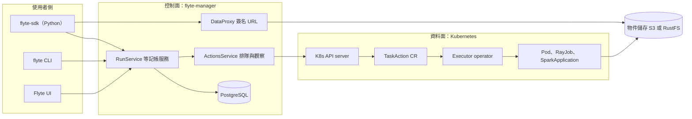

# 00 · Flyte 2 是什麼

> 這一頁回答：Flyte 2 是什麼、解決什麼問題、它刻意不是什麼，以及整個系統由哪些部分組成。

## 一句話

Flyte 2 是一個 Kubernetes 原生的工作流與 AI 任務執行平台。使用者在 Python 裡把函式標成 task，後端把每一次執行記成一棵 Run 底下的 Action 樹，用 Kubernetes 自訂資源與 plugin 把每個 action 變成 Pod、Ray、Spark 等真實工作負載。

## 它解決的問題

一個團隊有很多 Python 函式要在 Kubernetes 上跑成 ML 或 AI 流程，需要：

- 每一步都能重試、快取、追蹤輸入輸出、限制資源。
- 平台團隊能跨 project 與 domain 集中治理 secrets、預設資源、queue、排程。
- 流程的形狀常常要到執行中才知道：依前一步結果決定 fan-out 幾個、要不要停下來等人簽核。

Flyte 1 用靜態 DAG 解前兩點，第三點做不好；Flyte 2 把「一次執行」改成動態長出來的 Action 樹，三點一起解。

## 它不是什麼

| 不是 | 為什麼，證據在哪 |
|---|---|
| 排程器中心的 DAG 引擎 | 後端沒有任何 workflow 定義的 proto，流程形狀由父 task 的 Python 程式在執行中決定。見 `flyteidl2/workflow/` 與 [02 沒有 DAG](./02-core-concepts/no-dag-dynamic-enqueue.md) |
| Python SDK 本體 | SDK 在另一個 repo `flyteorg/flyte-sdk`；這個 repo 是 Go 後端與 API 契約。見 `README.md` |
| 通用 durable execution 平台 | `TrackedRunService` 只記錄在平台外自行執行的 run，平台不排程也不介入。見 `flyteidl2/workflow/tracked_run_service.proto` |
| UI 優先的低碼編排工具 | UI 是獨立 repo `flyteconsole`，由 app 服務代理；流程一律用程式碼定義。見 `manager/README.md` |
| 資料儲存 | 控制面只持有 URI，資料放物件儲存，`DataProxy` 只發簽名 URL。見 `dataproxy/README.md` |

## 全景圖

三條線值得先記住：使用者只跟控制面說話；控制面把工作變成 `TaskAction` 自訂資源交給 Kubernetes；資料不經過控制面，直接在 Pod 與物件儲存之間流動。

## 五問速答

| 問 | 答 |
|---|---|
| 解決什麼問題 | 在 Kubernetes 上可靠地跑 Python 定義的 ML 與 AI 流程，每步可重試、可快取、可治理，而且流程形狀可以在執行中決定。 |
| 考慮過什麼替代方案 | repo 內可見的取捨：用單一 `ActionsService` 取代 `StateService` 加 `QueueService`；用 CRD 而非自建 queue 承載 action。與其他產品的比較見下方假設。 |
| 怎麼解決 | 三個角色：RunService 記帳進 PostgreSQL、ActionsService 把 action 變成 CR 並串流狀態、Executor 用 plugin 產生 Pod。SDK 在父 task 的 Pod 裡當 controller 動態排入子 action。 |
| 有什麼限制與風險 | 只支援 Kubernetes；每個 action 一個 CR；API 仍在快速演進；fork PR 的 CI 不完整；SDK 端 controller 不在本 repo。 |
| 是最佳方案嗎 | 對「Python 為主、Kubernetes 為底、要型別化資料與快取、又要動態控制流」的團隊是目前最一致的解。它刻意不做非 Kubernetes 執行、通用 durable execution、UI 優先編排。 |

定位假設：與 Airflow、Argo Workflows、Prefect、Temporal 的差異未在本地圖核對，只能說 Flyte 2 的重心是 Kubernetes 原生、型別化資料介面與動態 Action 樹。

## 你是誰，從哪裡開始

- 想貢獻程式碼：先讀 [01 背景知識](./01-background/README.md)，再進 [02 核心概念](./02-core-concepts/README.md)。
- 只想部署使用：本地圖不涵蓋，請看 `charts/` 各 chart 的 README 與 union.ai 的 Flyte 2 文件。

## 證據

`README.md`、`docs/BACKEND_README.md`、`manager/README.md`、`flyteidl2/workflow/`、`flyteidl2/actions/actions_service.proto`、`dataproxy/README.md`。

<!-- nav -->
---

[總覽](./README.md) ｜ 下一頁 [01 · 背景知識](./01-background/README.md)
