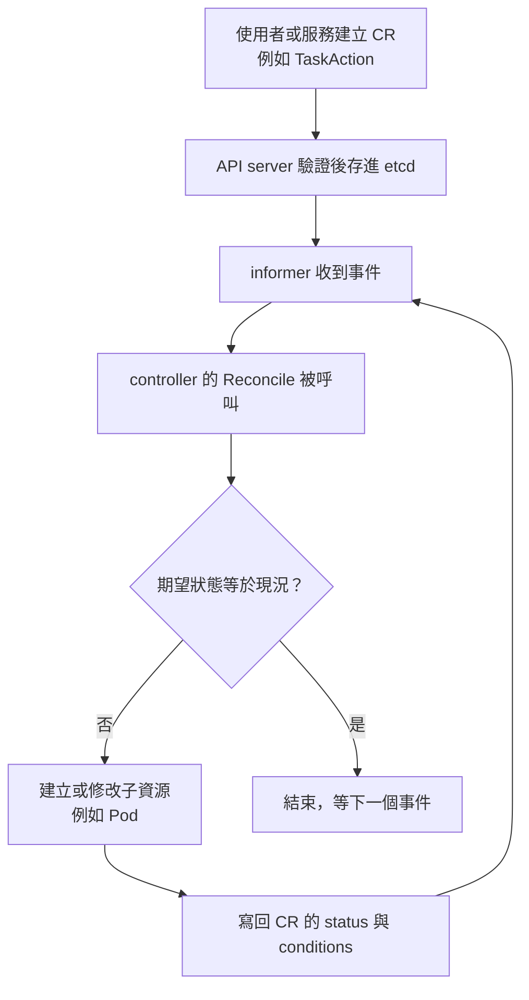

# 01 · 背景知識：讀 02 之前要認識的六個外部概念

> 這一頁回答：沒有 Kubernetes、Go、protobuf 背景的人，要先知道哪六件事，才讀得懂 Flyte 2 的核心概念。每個概念一段話加一個外部連結，不做教學。

## 1. 工作流排程系統做四件事

定義（把工作拆成步驟與依賴）、排程（決定何時何地跑）、執行（真的跑起來並處理失敗）、觀測（看得到進度與結果）。Flyte 2 的對應：定義是 Python 的 task 與 `TaskEnvironment`；排程是 `RunService`、`TriggerService` 與 queue；執行是 `TaskAction` 加 Executor 加 plugin；觀測是 `WatchRunDetails`、`action_events` 表與 UI。讀後面任何一頁時，先問自己「這在講四件事的哪一件」。

## 2. Kubernetes 的 operator、CRD 與 reconcile loop

Kubernetes 允許你定義自己的資源型別（Custom Resource Definition，CRD），並寫一個 controller 持續把「現況」推向資源上宣告的「期望狀態」。這個 controller 加 CRD 的組合叫 operator。Flyte 2 的 `TaskAction` 就是一個 CRD，Executor 就是它的 operator。

兩個詞會一直出現：**informer** 是 client 端的快取加事件通知機制，**finalizer** 是掛在資源上的標記，讓資源被刪除前 controller 有機會先清理。延伸閱讀：[Kubernetes 官方文件的 Operator pattern](https://kubernetes.io/docs/concepts/extend-kubernetes/operator/)。

## 3. Pod、init container 與 sidecar

Pod 是一組共享網路與儲存的容器。init container 在主容器之前依序跑完；sidecar 與主容器並行。Flyte 2 用 `flyte-copilot` 當 init container 下載輸入、當 sidecar 等主容器結束後上傳輸出，所以使用者的容器不需要知道 Flyte 存在。延伸閱讀：[Pods](https://kubernetes.io/docs/concepts/workloads/pods/)。

## 4. protobuf、gRPC 與 Connect

protobuf 是一種型別化的訊息定義語言，`.proto` 檔同時是文件與程式碼產生器的輸入。gRPC 在 protobuf 之上定義服務與 RPC，支援串流。Connect 是與 gRPC 相容、同時能走一般 HTTP 的實作，Flyte 2 的 Go 服務用的是 Connect。你會在 proto 裡看到 `rpc Watch... returns (stream ...)`，那就是伺服器端串流。延伸閱讀：[protobuf.dev](https://protobuf.dev/overview/)、[connectrpc.com](https://connectrpc.com/docs/introduction)。

## 5. buf

buf 是 protobuf 的工具鏈：格式化、lint、相容性檢查、依設定檔一次產出多種語言的程式碼。Flyte 2 的 `buf.yaml` 與四個 `buf.gen.*.yaml` 決定 `gen/` 裡的 Go、TypeScript、Python、Rust 產物長什麼樣。改 proto 不跑 buf，CI 會擋。延伸閱讀：[buf 文件](https://buf.build/docs/)。

## 6. Helm chart 與 k3d

Helm 是 Kubernetes 的套件管理，一個 chart 是一組可帶參數的 YAML 範本。k3d 是在 Docker 裡跑一個輕量 Kubernetes 叢集的工具。Flyte 2 用四個 chart 描述部署方式，用 k3d 打包成一個叫 devbox 的本機環境。延伸閱讀：[helm.sh](https://helm.sh/docs/intro/using_helm/)、[k3d.io](https://k3d.io/)。

## 讀到這裡你應該能

看到 `TaskAction`、informer、finalizer、sidecar、Connect 串流、`make gen`、devbox 這些詞，知道它們各自屬於上面哪一段。

## 證據

`executor/README.md`、`flytecopilot/README.md`、`buf.yaml`、`buf.gen.go.yaml`、`charts/`、`docker/devbox-bundled/`。外部連結為各工具官方文件。

<!-- nav -->
---

上一頁 [00 · Flyte 2 是什麼](../00-what-is-flyte2.md) ｜ [總覽](../README.md) ｜ 下一頁 [02 · 核心概念總表](../02-core-concepts/README.md)
