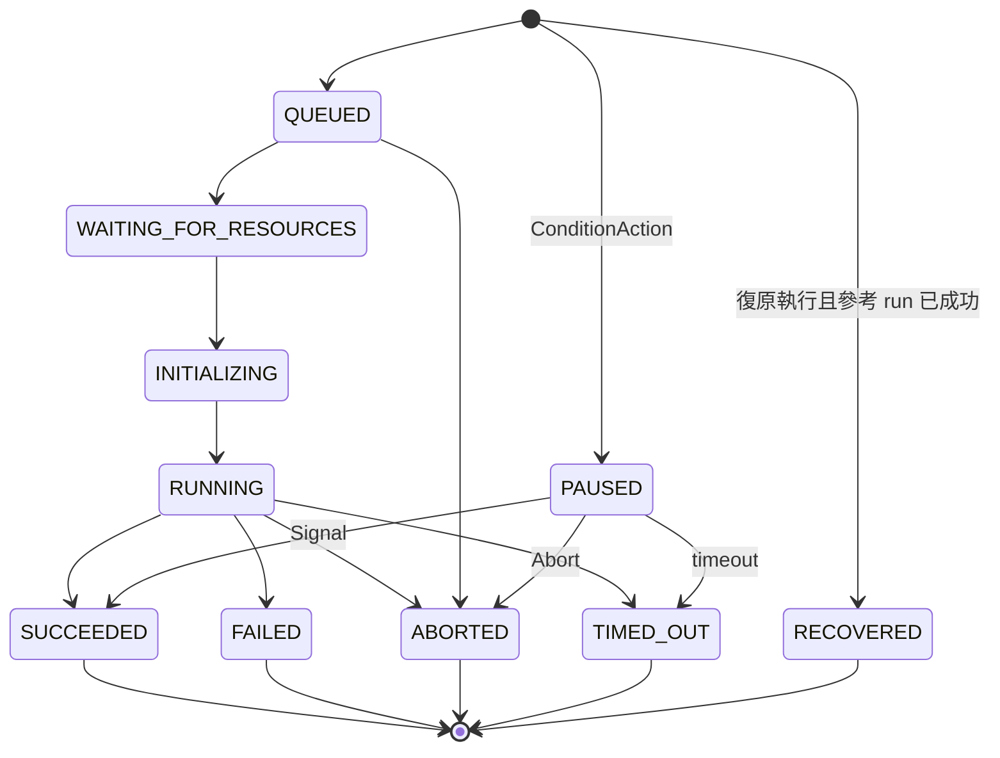

# ActionPhase 狀態機

> 這一頁回答：一個 action 會經過哪些狀態、哪些是終態、誰負責把它推進下一個狀態。

## 十個狀態

| 狀態 | 意思 | 主要由誰推進 |
|---|---|---|
| `QUEUED` | 已接受，等待排程 | `ActionsService.Enqueue` 建立 CR 時 |
| `WAITING_FOR_RESOURCES` | 已排程，等計算資源 | Executor 與 plugin |
| `INITIALIZING` | 資源到位，正在建立 | Executor 與 plugin |
| `RUNNING` | 執行中 | Executor 觀察 Pod |
| `SUCCEEDED` | 成功，終態 | Executor |
| `FAILED` | 失敗，終態 | Executor |
| `ABORTED` | 被人或系統中止，終態 | `RunService.AbortRun` 或 `AbortAction` 觸發 |
| `TIMED_OUT` | 超過 attempt 的 max runtime 或 condition 的 timeout，終態 | Executor |
| `PAUSED` | ConditionAction 等待訊號 | Executor 建立 condition 時 |
| `RECOVERED` | 復原執行時沿用參考 run 的結果，終態，控制流上視同成功 | `RunService` 建立復原 run 時 |

終態有五個：`SUCCEEDED`、`FAILED`、`ABORTED`、`TIMED_OUT`、`RECOVERED`。`RunService.WatchActionDetails` 等串流會在 action 到達終態時結束。

## 這個 phase 與 Kubernetes 上的狀態是兩套

proto 裡的 `ActionPhase` 是對外 API 用的；`TaskAction` 自訂資源上用的是 Kubernetes 慣例的 condition 加 reason，兩者由 Executor 對應。對照表見 [taskaction-crd-and-executor.md](./taskaction-crd-and-executor.md)。plugin 內部還有第三套 `pluginmachinery` 的 Phase。看程式碼時先確認你看的是哪一套。

## 至少一次送達與 sentinel

`ActionsService.WatchForUpdates` 與 `StateService.Watch` 都保證至少一次送達。開始訂閱時，服務先送目前所有 action 的現況，再送一個 `ControlMessage.sentinel`，之後才是新的更新。消費端要用 sentinel 區分「這是快照」與「這是新事件」，並容忍重複。

## 讀到這裡你應該能

看到 `phase` 欄位或 `IsTerminalPhase` 這類函式，知道它在說哪一套狀態、哪些值會讓串流結束。

## 證據

`flyteidl2/common/phase.proto`、`flyteidl2/workflow/run_service.proto`、`flyteidl2/workflow/state_service.proto`、`flyteidl2/actions/actions_service.proto`、`runs/service/run_service.go`（`IsTerminalPhase`）。

<!-- nav -->
---

上一頁 [02 · Run 與 Action 樹](./run-and-action-tree.md) ｜ [總覽](../README.md) ｜ 下一頁 [02 · 沒有 DAG](./no-dag-dynamic-enqueue.md)
