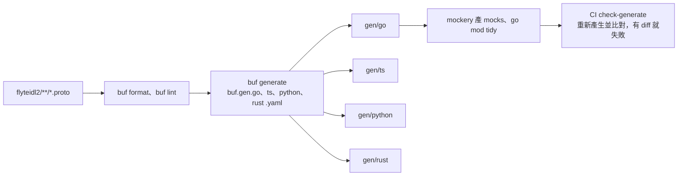

# 契約優先與多語言產碼

> 這一頁回答：proto 改一行之後會流到哪裡，以及為什麼 `flyteidl2/` 是這個 repo 裡規矩最多的目錄。

## 從 proto 到四種語言

`make gen` 用 Docker 映像檔跑上面整條；`make gen-local` 用本機的 buf、go、cargo、uv。產物放在 `gen/`，**要一起 commit**。CI 的 `check-generate` 會重跑產碼並比對，有差異就失敗；同一個 workflow 還有 `check-go-tidy` 與 `check-mocks` 兩個 job。

## flyteidl2 裡有什麼

| 套件 | 內容 |
|---|---|
| `common` | 識別碼、phase、identity、list、policy、role、run、runtime_version |
| `core` | Flyte 1 傳承下來的型別：literals、types、interface、tasks、execution、security、catalog |
| `task` | TaskSpec、TaskIdentifier、Environment、RunSpec、TaskService |
| `workflow` | Run、Action、RunService、InternalRunService、QueueService、StateService、TrackedRunService、TranslatorService、RunLogsService、EventsProxyService |
| `actions` | ActionsService |
| `app`、`cacheservice`、`secret`、`trigger`、`project`、`settings`、`dataproxy`、`cluster`、`connector`、`imagebuilder`、`logs`、`auth`、`org`、`artifact`、`notification`、`event` | 各服務自己的訊息與 RPC |
| `plugins` | 各 plugin 的 `custom` 欄位結構：spark、ray、dask、kubeflow、clustered 等 |

## 規矩

1. **不改欄位號碼、不改型別**。移除欄位用 `reserved`，`RunSpec` 與 `TaskAction` 裡的 `cluster` 就是這樣被 reserved 後改成 `queue`。
2. **命名**：欄位 `snake_case`、訊息 `PascalCase`、enum 值 `SCREAMING_SNAKE_CASE`。
3. **每個訊息、欄位、enum 都要有註解**。這個 repo 的 proto 註解品質很高，是理解行為最快的入口。
4. **`flyteidl2/` 的 PR 需要 `@flyteorg/flyteidl2-contributors` 核可**，其餘目錄預設 `@flyteorg/flyte2-contributors`。
5. **release 時四種產物各自發布**：Go module `github.com/flyteorg/flyte/v2`、npm `@flyteorg/flyte`、PyPI `flyteidl2`、crates.io `flyte`。

## 為什麼這麼嚴

四種語言的 client 都從同一份 proto 產生，`flyte-sdk`（Python）、`flyteconsole`（TypeScript）、`flyte-sdk-rs`（Rust）都依賴這裡發布的產物。一個欄位號碼改錯，四個下游一起壞。

## 讀到這裡你應該能

改一個 proto 欄位時知道要跑什麼、commit 什麼、誰會來核；看到 `gen/` 裡的檔案知道不能手改。

## 證據

`buf.yaml`、`buf.gen.go.yaml`、`buf.gen.ts.yaml`、`buf.gen.python.yaml`、`buf.gen.rust.yaml`、`Makefile`、`.mockery.yaml`、`.github/workflows/check-generate.yml`、`CODEOWNERS`、`CONTRIBUTING.md`、`flyteidl2/` 目錄清單。
