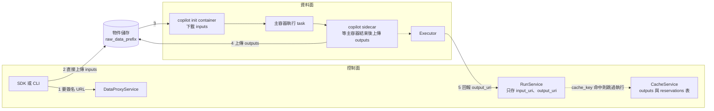

# 控制面與資料面

> 這一頁回答：任務的輸入輸出怎麼進出 Pod，而不經過 API server 與控制面。

## 資料的路

## 三個角色

**DataProxy** 住在控制面，物件儲存住在資料面，它是兩邊的橋：發上傳與下載的簽名 URL、代上傳輸入、讀 action 的輸入輸出、tail 日誌、以及 `ClusterService.SelectCluster`。`RunService.GetActionData` 已標 deprecated，改由 DataProxy 提供。

**flyte-copilot** 是一個小二進位，兩種模式：`downloader` 當 init container，把輸入從物件儲存拉到共享 volume；`sidecar` 與主容器並行，等主容器結束後把輸出上傳。這讓任意容器都能當 Flyte task，容器本身不需要 Flyte 的程式庫。

**CacheService** 記兩件事：某個 `cache_key` 的輸出在哪，以及誰正在算它（reservation）。有 reservation 機制是為了避免多個相同任務同時重算。

## 控制面只持有 URI

`RunService` 的資料表只存 `input_uri`、`output_uri` 與事件，`TaskAction` CR 上也只有 `inputUri` 與 `runOutputBase`。實際資料的位置由 `RunSpec.raw_data_storage.raw_data_prefix` 決定。這個設計的後果：控制面可以很小，但物件儲存的存取權限是資料面能不能跑的前提；`CacheLookupScope` 提供全域或 project 與 domain 範圍的快取查詢，就是因為不同 project 可能拿不到彼此的 bucket。

## 本機環境對應

devbox 用 RustFS 當物件儲存，`scripts/start-rustfs.sh` 可以單獨啟動，`dataproxy/README.md` 有 RustFS 的設定段落。

## 讀到這裡你應該能

看到 `input_uri`、`raw_data_prefix`、`copilot`、`reservation` 這些詞，知道資料此時在哪一邊、誰負責搬。

## 證據

`dataproxy/README.md`、`flyteidl2/dataproxy/dataproxy_service.proto`、`flytecopilot/README.md`、`flyteplugins/go/tasks/pluginmachinery/flytek8s/copilot.go`、`cache_service/migrations/sql/`、`flyteidl2/task/run.proto`（`RawDataStorage`、`CacheLookupScope`）、`flyteidl2/cluster/service.proto`。

<!-- nav -->
---

上一頁 [02 · 統一 manager 與八個服務](./manager-and-services.md) ｜ [總覽](../README.md) ｜ 下一頁 [03 · 從 flyte.run() 到 Pod 結束](../03-how-it-runs/create-run-to-pod.md)
