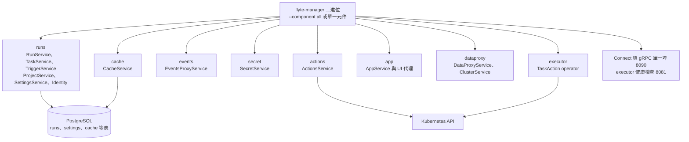

# 統一 manager 與八個服務

> 這一頁回答：`flyte-manager` 這個二進位裡裝了哪些服務、它們共用什麼、怎麼拆開部署。

## 一個二進位、八個 component

`manager/cmd/main.go` 只做一件事：讀 `--component` 旗標，從 `components.go` 的表找到對應的 setup 函式。`all` 會依序啟動 runs、dataproxy、events、cache、executor、actions、app、secret。每個 component 的目錄下都有自己的 `setup.go` 與 `cmd/main.go`，所以也能各自當獨立程序跑。

## 每個 component 負責什麼

| component | 目錄 | 對外服務 | 一句話 |
|---|---|---|---|
| runs | `runs/` | RunService、InternalRunService、TaskService、TriggerService、ProjectService、SettingsService、IdentityService、AuthMetadataService、TranslatorService | 記帳：把 task、run、action、event、trigger、settings 寫進 PostgreSQL 並提供查詢與串流；內含 cron 排程器 |
| actions | `actions/` | ActionsService | 把 action 變成 `TaskAction` CR，用 informer 監看並串流狀態 |
| executor | `executor/` | 無對外 RPC，只有健康檢查 | 監看 `TaskAction`，用 plugin 產生工作負載 |
| dataproxy | `dataproxy/` | DataProxyService、ClusterService | 發簽名 URL、上傳輸入、讀 action 資料、tail 日誌、選叢集 |
| events | `events/` | EventsProxyService | 接收 action 事件，轉送到 RunService 或 Redis stream |
| cache | `cache_service/` | CacheService | 任務輸出快取與 reservation |
| secret | `secret/` | SecretService | secret 的 CRUD |
| app | `app/` | AppService、AppLogsService | 部署與代理長駐服務，含 UI；推論底層用 Knative |

## 共用的東西

- **PostgreSQL**：runs 的 `projects`、`actions`、`action_events`、`tasks`、`task_specs`、`triggers`、`trigger_revisions`、`settings`，cache 的 `cache_service_outputs`、`cache_service_reservations`。migration 檔在各自的 `migrations/sql/`，啟動時自動跑。
- **`flytestdlib`**：config、logger、storage、database、metrics 等共用套件，也是 `stdlibapp.App` 這個統一啟動框架的來源。
- **一個埠**：所有 Connect 服務掛在 8090；executor 的 `/healthz`、`/readyz` 在 8081。

## 三種部署形狀

| chart | 形狀 | 適合 |
|---|---|---|
| `charts/flyte-binary` | 一個 Deployment 跑 `--component all` | 小型或測試環境 |
| `charts/flyte-core` | 每個 component 各自 Deployment，可獨立擴縮 | 生產環境 |
| `charts/flyte-devbox` | k3d 叢集內打包 flyte-binary、PostgreSQL、RustFS、Knative、registry | 本機開發，見 [03 devbox 拓樸](../03-how-it-runs/devbox-topology.md) |

`charts/flyteconnector` 是前兩者的依賴，部署 connector 服務。

## 讀到這裡你應該能

看到一個服務名，說出它在哪個目錄、跟哪個資料表或 Kubernetes 資源說話；知道 `make -C manager run` 跑起來的是全部八個 component。

## 證據

`manager/cmd/main.go`、`manager/cmd/components.go`、`manager/README.md`、各 component 的 `setup.go`、`runs/migrations/sql/`、`cache_service/migrations/sql/`、`charts/*/Chart.yaml`、`flytestdlib/`。

<!-- nav -->
---

上一頁 [02 · 契約優先與多語言產碼](./contract-and-codegen.md) ｜ [總覽](../README.md) ｜ 下一頁 [02 · 控制面與資料面](./control-plane-vs-data-plane.md)
