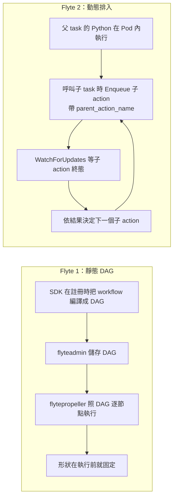

# 沒有 DAG：子 action 由 SDK 端動態排入

> 這一頁回答：流程的形狀由誰決定。這是 Flyte 2 與 Flyte 1 最大的差別，也是整張地圖的骨幹。

## 兩代的差別

## 後端知道什麼、不知道什麼

後端知道：每個 action 的 spec、parent、group、phase、輸入輸出 URI。後端不知道：接下來還會有幾個 action、它們之間的依賴。整棵樹是邊跑邊長出來的。

三個證據：

1. `flyteidl2/workflow/` 裡沒有任何 workflow 定義或編譯器的 proto，只有 run 與 action。
2. `ActionsService.Enqueue` 的請求帶 `parent_action_name`，`WatchForUpdates` 以 `parent_action_id` 訂閱所有子 action。這組 API 就是給「正在執行的父 action」用的。
3. `manager/README.md` 的「How It Works」寫 sdk controller 透過 `WatchForUpdates` 消費更新以推進 run。

## 這帶來的三個後果

- **fan-out 只在執行時可見**：UI 與 `ListActions` 看到的樹會隨時間長大，`run_state_manager.go` 在記憶體維護樹與各 phase 的計數就是為了這件事。
- **重試父 action 會重跑它的 Python**：所以需要 `TraceAction` 把非確定性的結果記下來，重跑時重放；也所以復原執行是「父 action 重跑、子 action 逐一判斷要不要沿用」，見 `Recover.force_rerun_actions` 的註解。
- **父 action 的 Pod 活著，流程才活著**：父 Pod 是流程的控制器。它被中止時，`ActionsService.Abort` 會連鎖中止所有子孫 action。

## 這一頁的邊界

SDK 端 controller 到底怎麼寫、用哪幾個 RPC、在 Python 還是 Rust（`flyte-sdk` 同時有 `_internal/controllers` 與 `rs_controller/`），都不在本 repo，列入地圖邊界第 2 條。上面關於 SDK 行為的描述是從後端 API 形狀推回去的。

## 讀到這裡你應該能

回答「Flyte 2 為什麼沒有 workflow 這個概念」，並說出 `parent_action_name`、`WatchForUpdates`、`TraceAction` 三者的關係。

## 證據

`flyteidl2/workflow/` 目錄清單、`flyteidl2/actions/actions_service.proto`、`manager/README.md`、`flyteidl2/task/run.proto`（`Recover`）、`runs/service/run_state_manager.go`。

<!-- nav -->
---

上一頁 [02 · ActionPhase 狀態機](./action-phase.md) ｜ [總覽](../README.md) ｜ 下一頁 [02 · TaskAction CRD 與 Executor](./taskaction-crd-and-executor.md)
