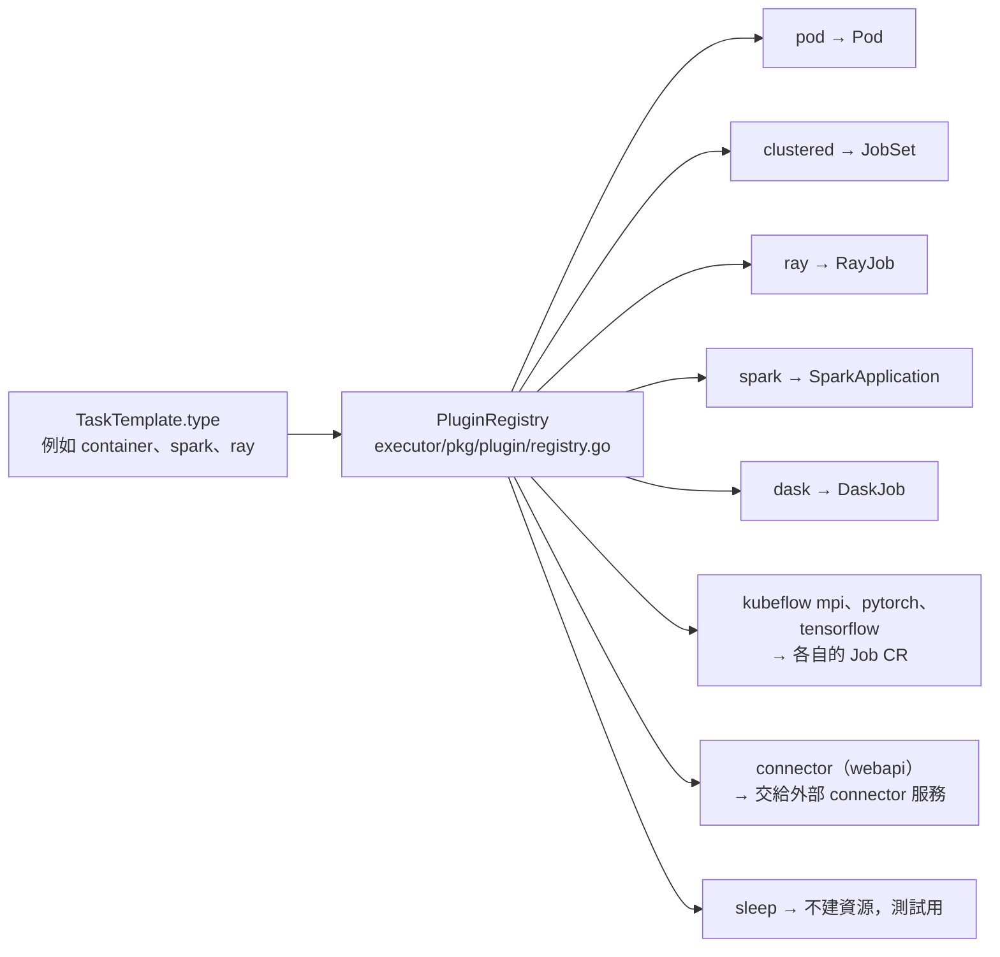

# Plugin 體系

> 這一頁回答：`TaskTemplate.type` 這個字串如何找到執行者，以及一個 plugin 要做哪幾件事。

## 從 taskType 到真實資源

Executor 啟動時把 plugin 註冊進 registry，之後每次 reconcile 用 `taskType` 查表。查不到就記 `PluginNotFound` 終態。

## 哪些 plugin 被載入

| 註冊處 | plugin | 產生的資源 |
|---|---|---|
| `executor/setup.go` | `pod`、`clustered` | Pod、JobSet |
| `executor/setup.go` | `connector` | 呼叫外部 connector 服務，任務不在本叢集跑 |
| `executor/plugins/loader.go` | `ray`、`spark`、`dask`、`kfoperators/mpi`、`kfoperators/pytorch`、`kfoperators/tensorflow`、`core/sleep` | 對應 operator 的 CR |

`loader.go` 只有一串底線 import，靠各 plugin 套件的 `init()` 自我註冊。要加一個 plugin，最少要做的事就是寫一個會在 `init()` 註冊的套件，然後在這裡 import 它。

## 一個 plugin 要做什麼

plugin 介面來自 Flyte 1 就有的 `pluginmachinery`，核心是三個動作與一個回傳值：

| 動作 | 意思 |
|---|---|
| `Handle` | 看目前狀態，該建資源就建、該查狀態就查，回傳一個 `PhaseInfo` |
| `Abort` | 清掉這個 action 建出的資源 |
| `Finalize` | 收尾 |

`PhaseInfo` 帶 plugin 內部的 Phase（NotStarted、Queued、Initializing、Running、Success、RetryableFailure、PermanentFailure 等）與版本號，Executor 把它對應到 CR 的 condition 與 reason。三套狀態的關係見 [action-phase.md](./action-phase.md)。

plugin 透過 `TaskExecutionContext` 拿到它需要的東西：序列化的 `TaskTemplate`、輸入輸出路徑、資源管理、secret 管理、狀態儲存。Executor 這邊的實作在 `executor/pkg/plugin/`。

## Kubernetes 類 plugin 的共用件

`flyteplugins/go/tasks/pluginmachinery/flytek8s/` 提供組 Pod 的共用函式：容器規格、資源、`PodTemplate` 套用、`flyte-copilot` 的 init container 與 sidecar。所以 `pod`、`clustered`、`ray`、`spark` 等 plugin 只需描述「自己的 CR 長什麼樣」，不用各自處理 Pod 細節。`executor/pkg/plugin/k8s/plugin_manager.go` 負責監看這些 CR 的事件。

## 快取與 secret

`pluginmachinery/catalog/` 是快取客戶端，`cache_key` 有值時先查 `CacheService`，命中就不執行；`executor/pkg/webhook/pod.go` 是 Pod 的 admission webhook，import 的是 `pluginmachinery/secret/config`，推論是負責把 secret 注入 Pod，細節未讀。

## 讀到這裡你應該能

看到一個 `taskType`，說出它會被哪個目錄的 plugin 接手、產生什麼 Kubernetes 資源；知道加新 plugin 要動 `loader.go`。

## 證據

`executor/plugins/loader.go`、`executor/setup.go`、`executor/pkg/plugin/`、`flyteplugins/go/tasks/pluginmachinery/core/`、`flyteplugins/go/tasks/pluginmachinery/flytek8s/`、`flyteplugins/go/tasks/plugins/`、`executor/pkg/webhook/`。
