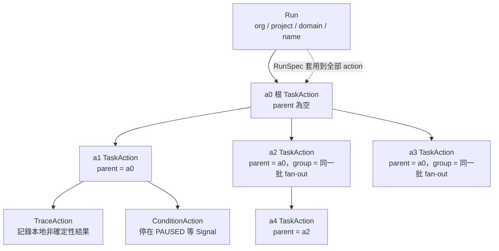

# Task、Run 與 Action 樹

> 這一頁回答：一次執行在資料上長什麼樣，以及 task、run、action 三個名字各指什麼。

## Task：可部署的最小單位

一個 task 是一段可以被排到 Kubernetes 上執行的程式，加上它的介面與執行需求。後端看到的是三層包裝：

| 層 | 內容 | 定義處 |
|---|---|---|
| `TaskTemplate` | `type` 字串（如 `container`、`spark`、`ray`）、型別化介面、`container` 或 `k8s_pod` 或 `sql` 三選一的執行目標、給 plugin 用的 `custom` Struct、資源需求、`reuse_policy` | `flyteidl2/core/tasks.proto` |
| `TaskSpec` | 一個 `TaskTemplate` 加預設輸入、顯示名 `short_name`、所屬 `Environment`、文件 | `flyteidl2/task/task_definition.proto` |
| `Task` | `TaskIdentifier`（org、project、domain、name、version）加部署者、部署時間、trigger 摘要 | 同上 |

`TaskTemplate.type` 是整個執行面的分岔點：Executor 用它查 plugin，見 [plugins.md](./plugins.md)。`name` 欄位註解特別寫「不要解析它」，人看的名字是 `short_name` 與 `environment_name`。

## Run 與 Action：一次執行是一棵樹

一次執行叫 run，以 org、project、domain、name 四段識別。run 的內容是一棵 action 樹，根節點慣稱 `a0`，每個 action 在 run 內有唯一名字，並記錄 `parent` 與 `group`。

三種 action：

- **TaskAction**：跑一個 task。帶 `TaskSpec`、可選的 `cache_key` 與 `queue`。
- **TraceAction**：不跑東西，只記錄「本地 worker 內某段非確定性程式的結果」，讓重試或復原時可以重放而不重算。proto 註解舉的例子是取當下時間。
- **ConditionAction**：等待外部訊號。帶期望的值型別、提示文字、可選的 timeout 與 webhook；建立後停在 `PAUSED`，被 `SignalEvent` 喚醒後以該值作為輸出。

`RunSpec` 掛在 run 上，套用到全部 action：labels、annotations、環境變數、`interruptible`、`queue`、原始資料前綴、security context、快取設定、通知、`run_start_time`、run 級並行上限。

## 狀態與嘗試

每個 action 有輕量的 `ActionStatus`（phase、起訖時間、attempt 數）與較重的 `ActionDetails`（含 attempts 明細、錯誤、abort 或 signal 資訊）。重試會產生新的 attempt，編號從 1 起算。

## 重跑與復原

`RunSpec.relation` 可以宣告這個 run 是某個 run 的 rerun 或 recover。復原執行時，參考 run 裡已成功的 action 直接記成 `RECOVERED`，不重跑；`Recover.force_rerun_actions` 是逃生口，指名的 action 一律重跑。

## 讀到這裡你應該能

看到 `a0`、`parent_action_name`、`group`、`attempt`、`RECOVERED` 這些詞，知道它們在樹上的位置。

## 證據

`flyteidl2/task/task_definition.proto`、`flyteidl2/task/environment.proto`、`flyteidl2/task/run.proto`、`flyteidl2/core/tasks.proto`、`flyteidl2/workflow/run_definition.proto`、`flyteidl2/workflow/tracked_run_service.proto`（`a0` 慣例）。
