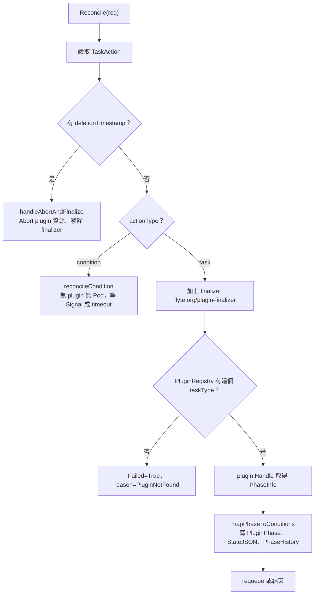

# TaskAction CRD 與 Executor

> 這一頁回答：Executor 收到一個 TaskAction 之後怎麼分流，以及 CR 上的 condition 與 reason 如何對應到 action 的狀態。

## TaskAction 這個自訂資源

每個要在 Kubernetes 上執行的 action 都是一個 `flyte.org/v1` 的 `TaskAction`。spec 是「要做什麼」，status 是「做到哪」。

| spec 欄位 | 意思 |
|---|---|
| `runName`、`project`、`domain`、`actionName`、`parentActionName` | 對應 action 在樹上的位置 |
| `actionType` | `task` 或 `condition`；空值視為 `task` |
| `taskType`、`taskTemplate` | 查 plugin 用的字串，與序列化後的 `TaskTemplate` bytes |
| `conditionSpec` | `condition` 專用，序列化的 `ConditionAction` |
| `inputUri`、`runOutputBase` | 輸入在哪、輸出寫去哪 |
| `cacheKey` | 有值就啟用快取查詢與回寫 |
| `envVars`、`interruptible`、`podTemplateName` | 從 `RunSpec` 投影下來的 run 級設定 |

status 上看得到 `conditions`、`PluginPhase`、`PluginPhaseVersion`、`StateJSON`、`PhaseHistory`。`PhaseHistory` 記每次 reason 轉換的時間，Executor 用它算 attempt 何時開始、有沒有超時。

## Reconcile 的分流

finalizer 的用途：CR 被刪除時，controller 先呼叫 plugin 的 `Abort` 清掉 Pod 或其他資源，再移除 finalizer 讓刪除完成。沒有 finalizer 的話，CR 一消失就找不到該清的資源。

## condition 與 reason 的對照

Kubernetes 慣例是用少數幾個 condition 表達「大狀態」，用 reason 表達「子狀態」。`TaskAction` 用三個 condition：

| condition | reason | 對應的 ActionPhase | 說明 |
|---|---|---|---|
| `Progressing=True` | `Queued` | `QUEUED` 或 `WAITING_FOR_RESOURCES` | 等待資源 |
| `Progressing=True` | `Initializing` | `INITIALIZING` | 建立中 |
| `Progressing=True` | `Executing` | `RUNNING` | 執行中 |
| `Progressing=True` | `Paused` | `PAUSED` | condition 等訊號 |
| `Progressing=True` | `RetryableFailure` | 仍在進行 | 這次 attempt 失敗但可重試（依註解推論） |
| `Succeeded=True` | `Completed` | `SUCCEEDED` | 終態，不再 reconcile |
| `Succeeded=True` | `Signaled` | `SUCCEEDED` | condition 收到訊號，終態 |
| `Failed=True` | `PermanentFailure` | `FAILED` | 終態 |
| `Failed=True` | `Aborted` | `ABORTED` | 終態 |
| `Failed=True` | `TimedOut` | `TIMED_OUT` | attempt 超過 max runtime 或 condition 超時，終態 |
| `Failed=True` | `PluginNotFound` | `FAILED` | 沒有 plugin 能處理這個 `taskType`，終態 |
| `Failed=True` | `InvalidSpec` | `FAILED` | spec 缺必要欄位，終態 |

`Succeeded` 與 `Failed` 是終態 condition，一旦為 True 就不再 reconcile；之後由 `garbage_collector.go` 清理 CR。

## 這裡是新手 issue 的集中地

快照當日 11 個標 `flyte2` 的 good first issue 裡，多數是 Executor 與 ActionsService 的指標與 reconcile 設定。讀懂這一頁的分流圖，就能定位大部分的入手點。見 [05 從 issue 到程式碼](../05-contribution-paths/from-issue-to-code.md)。

## 讀到這裡你應該能

打開 `taskaction_controller.go` 時知道 `Reconcile`、`reconcileTask`、`reconcileCondition`、`handleAbortAndFinalize` 各在分流圖的哪個框，並能把 CR 上的 reason 翻譯成對外的 phase。

## 證據

`executor/api/v1/taskaction_types.go`、`executor/pkg/controller/taskaction_controller.go`、`executor/pkg/controller/taskaction_condition.go`、`executor/pkg/controller/garbage_collector.go`、`executor/config/crd/bases/`、`executor/README.md`。

<!-- nav -->
---

上一頁 [02 · 沒有 DAG](./no-dag-dynamic-enqueue.md) ｜ [總覽](../README.md) ｜ 下一頁 [02 · Plugin 體系](./plugins.md)
