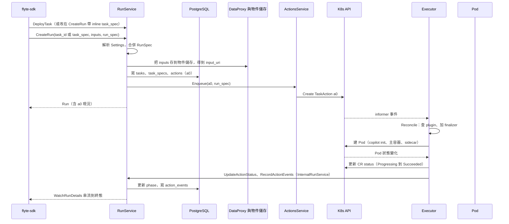

# 從 `flyte.run()` 到 Pod 結束

> 這一頁回答：使用者呼叫 `flyte.run()` 之後，依序發生哪九件事、經過哪些服務。

## 時序

## 九步對照

| 步 | 發生什麼 | 在哪裡 |
|---|---|---|
| 1 | SDK 註冊 task 或直接帶 inline spec，呼叫 `CreateRun` | `flyteidl2/workflow/run_service.proto` 的 `CreateRunRequest` 三選一：`task_id`、`task_spec`、`trigger_name` |
| 2 | RunService 取 TaskSpec、依 org、domain、project 解析 Settings 合併 RunSpec、存 inputs、寫三張表 | `runs/service/run_service.go` 的 `CreateRun`、`persistRunModel` |
| 3 | 呼叫 `ActionsService.Enqueue`，在 Kubernetes 建 `TaskAction` | `actions/service/actions_service.go`、`actions/k8s/client.go` |
| 4 | Executor reconcile：依 `actionType` 分流、查 plugin、加 finalizer | `executor/pkg/controller/taskaction_controller.go` |
| 5 | plugin 建 Pod；raw container 會加 copilot init 與 sidecar | `flyteplugins/go/tasks/pluginmachinery/flytek8s/` |
| 6 | 每次 phase 變化寫回 CR status，並記事件到 `action_events` | `executor/pkg/controller/event_batcher.go`、`flyteidl2/workflow/internal_run_service.proto` |
| 7 | ActionsService 的 informer 看到 CR 變化，`WatchForUpdates` 推給父 action | 見 [parent-child-watch.md](./parent-child-watch.md) |
| 8 | CLI 與 UI 用 `WatchRunDetails`、`WatchActions` 從資料庫讀進度 | `runs/service/run_service.go`、`runs/service/run_state_manager.go` |
| 9 | 終態後 GC 清 CR；有 `cache_key` 且命中時第 4 到 6 步整段省略 | `executor/pkg/controller/garbage_collector.go`、`cache_service/` |

## 兩條路徑要分清楚

`flyte.run()` 的呼叫端是**平台外**的客戶端，它拿進度是走 `RunService.WatchRunDetails`，資料來自 PostgreSQL。父 task 的 Python 是**平台內**正在執行的 action，它拿子 action 進度是走 `ActionsService.WatchForUpdates`，資料來自 informer。前者看到的是記帳結果，後者看到的是 Kubernetes 上的即時狀態。

## 讀到這裡你應該能

指出任一個服務在這條時序上的位置；知道 Settings 在 CreateRun 時就已經被合併進 RunSpec，之後所有 action 都沿用。

## 證據

`runs/service/run_service.go`、`runs/service/settings_resolve.go`、`actions/k8s/client.go`、`executor/pkg/controller/taskaction_controller.go`、`flyteidl2/workflow/run_service.proto`、`flyteidl2/workflow/internal_run_service.proto`、`manager/README.md` 的「How It Works」。
