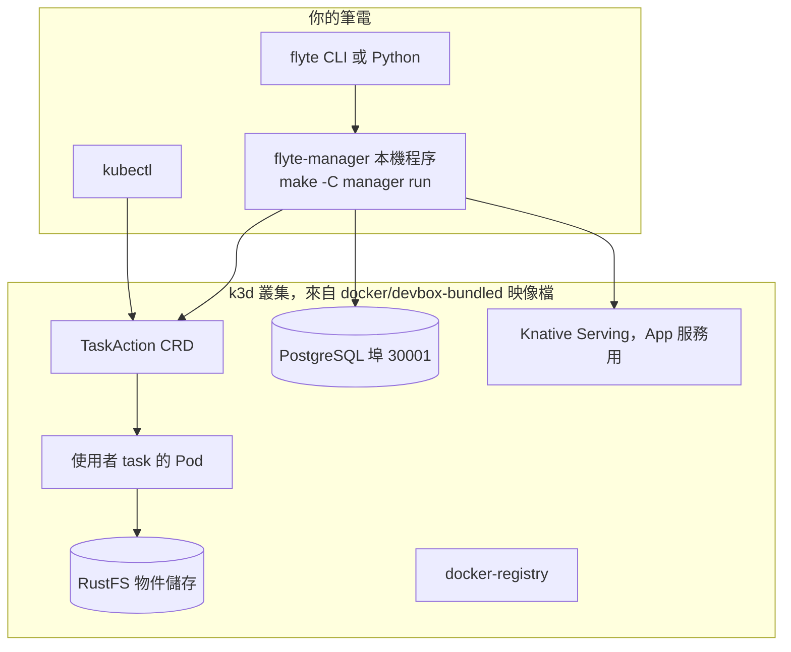

# devbox 拓樸：本機開發環境有哪些盒子

> 這一頁回答：照 `CONTRIBUTING.md` 跑起 devbox 之後，你的筆電上到底多了哪些東西、它們怎麼連。

## 拓樸

## 三個指令

| 指令 | 做什麼 |
|---|---|
| `make devbox-build` | 建 devbox 映像檔，第一次或 Dockerfile 改了才需要 |
| `make devbox-run FLYTE_DEV=true` | 在 Docker 裡啟動 k3d 叢集，寫入 kubeconfig；`FLYTE_DEV=true` 關掉叢集內的 manager，讓你本機跑的接手 |
| `make -C manager run` | 在本機跑 `flyte-manager`，連叢集的 PostgreSQL 並跑 migration，開始 reconcile |

停止用 `make devbox-stop`。加觀測用 `make devbox-monitoring`，Grafana 在 30300 埠。

## 為什麼 manager 在叢集外

這樣改 Go 程式碼後重啟的是本機程序，不用重建映像檔、重佈到叢集。executor 也在這個程序裡，所以它是從叢集外面監看 `TaskAction` 並建 Pod。

## 每個盒子對應的概念

| 盒子 | 概念頁 |
|---|---|
| `flyte-manager` | [統一 manager](../02-core-concepts/manager-and-services.md) |
| `TaskAction` CRD 與 Pod | [TaskAction 與 Executor](../02-core-concepts/taskaction-crd-and-executor.md) |
| PostgreSQL | [統一 manager](../02-core-concepts/manager-and-services.md) 的共用資料表 |
| RustFS | [控制面與資料面](../02-core-concepts/control-plane-vs-data-plane.md) |
| Knative Serving | App 服務，本地圖不展開 |
| docker-registry | 存本機建的 task 映像檔 |

`charts/flyte-devbox/Chart.yaml` 列出這些依賴：`docker-registry`、`flyte-binary`、`knative-serving`、`rustfs`。CI 的 `devbox.yml` 也用同一套環境跑 `flyte-sdk` 的範例當功能測試。

## 讀到這裡你應該能

跑起環境後，說出每個 `docker ps` 與 `kubectl get pods -A` 看到的東西是誰；知道改 Go 程式碼只需重啟本機的 manager。

## 證據

`CONTRIBUTING.md`（Running Flyte Locally）、`Makefile`（devbox 目標）、`docker/devbox-bundled/`、`charts/flyte-devbox/Chart.yaml`、`manager/README.md`（Testing）、`.github/workflows/devbox.yml`。

<!-- nav -->
---

上一頁 [03 · 失敗、重試、超時、中止](./failure-retry-abort.md) ｜ [總覽](../README.md) ｜ 下一頁 [04 · 程式碼地形](../04-code-terrain/directory-map.md)
