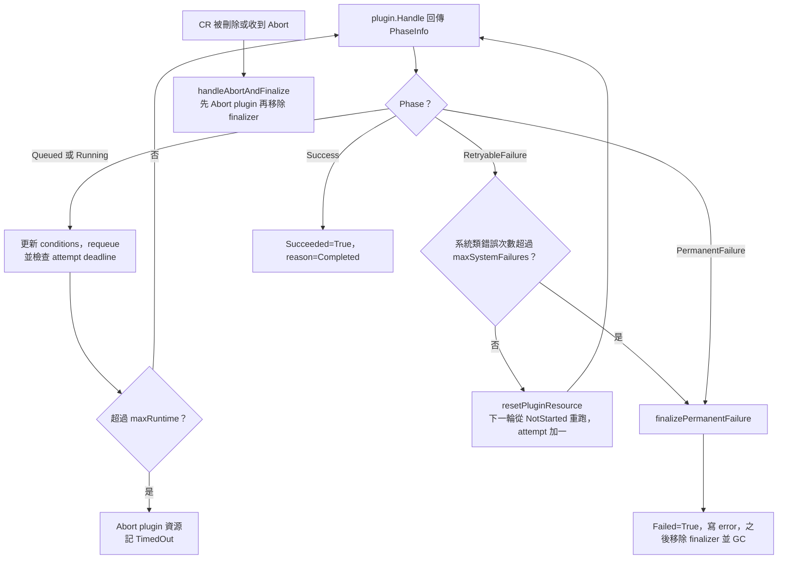

# 失敗、重試、超時、中止

> 這一頁回答：plugin 回報出錯時，Executor 怎麼決定重試、失敗還是超時，以及中止是怎麼傳到 Pod 的。

## 決策流程

## 兩種失敗

| 類型 | 誰判定 | 後果 |
|---|---|---|
| `RetryableFailure` | plugin | 重置 plugin 狀態，下一次 reconcile 從頭再跑一個 attempt |
| `PermanentFailure` | plugin | 直接終態 |

`RetryableFailure` 又分系統類與使用者類。系統類（例如 API server 暫時失敗）由 `maxSystemFailures` 設上限，超過就轉成永久失敗。使用者類的重試次數應由 `TaskTemplate` 的 metadata 決定，本地圖未細讀，標為推論。

## 超時

`TaskTemplate` 可宣告每個 attempt 的 max runtime。Executor 從 `PhaseHistory` 算出這個 attempt 何時開始，超過就先 `Abort` plugin 資源再記 `TimedOut`。程式碼特別處理了「先標記 timeout pending 再 Abort」的順序，避免 Abort 找不到該清的資源。Condition 的 timeout 走同一個 reason。

## 中止

中止從控制面發起、在資料面完成：

1. 使用者呼叫 `RunService.AbortRun` 或 `AbortAction`。
2. RunService 先在資料庫標記 `abort_requested_at`，再交給 `AbortReconciler` 背景處理。
3. `AbortReconciler` 呼叫 `ActionsService.Abort`，它會連鎖到所有子孫 action。
4. 在 Kubernetes 上表現為 `TaskAction` 被刪除或標記中止，Executor 走 `handleAbortAndFinalize`：先呼叫 plugin 的 `Abort` 清資源，再移除 finalizer。

第 4 步的細節（刪除還是標記）未細讀，標為推論。

## 讀到這裡你應該能

看到 `RetryableFailure`、`maxSystemFailures`、`TimedOut`、`abort_requested_at` 這些詞，知道它們在流程圖上的位置；知道 finalizer 是中止能清乾淨資源的關鍵。

## 證據

`executor/pkg/controller/taskaction_controller.go`（`reconcileTimedOutAttempt`、`resetPluginResource`、`finalizePermanentFailure`、`maxSystemFailures`、`handleAbortAndFinalize`）、`runs/service/abort_reconciler.go`、`runs/migrations/sql/20260408110000_init_schema.sql`（`idx_actions_abort_pending`）、`flyteidl2/actions/actions_service.proto`（`Abort` 連鎖說明）。
