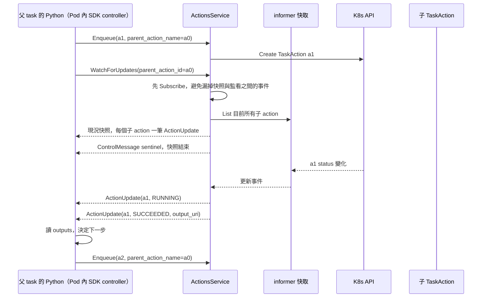
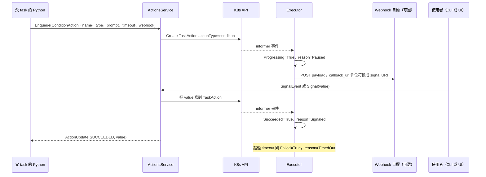

# 父子 action 的 Watch 與 Enqueue；Condition 的 Signal

> 這一頁回答兩個問題：父 action 如何得知子 action 完成並排下一個；停在 PAUSED 的 Condition 怎麼被喚醒。

## 父 action 如何得知子 action 完成

三個設計點：

1. **先訂閱再列表**。`WatchForUpdates` 的實作先 `Subscribe` 再 `List`，否則快照與監看之間的事件會漏掉。
2. **sentinel 分隔快照與新事件**。消費端收到 sentinel 之前的都是現況，之後的才是變化。
3. **至少一次送達**。消費端要能容忍同一個更新收到兩次。

`Subscribe` 的 key 是 run 名稱加父 action 名稱，所以一個父 action 只會收到自己子孫的更新。

## Condition 的 PAUSED 與 Signal

`ConditionAction` 是「等一個外部值」的 action，典型用途是人工簽核或等外部系統回呼。

`RunService.SignalEvent` 是給人用的入口，接受 bool、int、float、string 的 payload，轉成 `Literal` 後轉呼叫 `ActionsService.Signal`。`Signal` 對非 condition 或已終態的 action 回 `FAILED_PRECONDITION`。webhook 由後端在 condition 建立時發出，發送者是 Executor 還是 ActionsService 未細讀。

## 讀到這裡你應該能

解釋為什麼 Flyte 2 的 fan-out 不需要後端知道流程；知道 sentinel 的用途；知道人工簽核在資料模型上就是一個停在 PAUSED 的 action。

## 證據

`actions/service/actions_service.go`（`WatchForUpdates`、`Signal`）、`actions/k8s/client.go`（`Subscribe`、`Signal`）、`flyteidl2/actions/actions_service.proto`、`flyteidl2/workflow/run_definition.proto`（`ConditionAction`、`ConditionWebhook`）、`runs/service/run_service.go`（`SignalEvent`、`payloadToLiteral`）。

<!-- nav -->
---

上一頁 [03 · 從 flyte.run() 到 Pod 結束](./create-run-to-pod.md) ｜ [總覽](../README.md) ｜ 下一頁 [03 · 失敗、重試、超時、中止](./failure-retry-abort.md)
