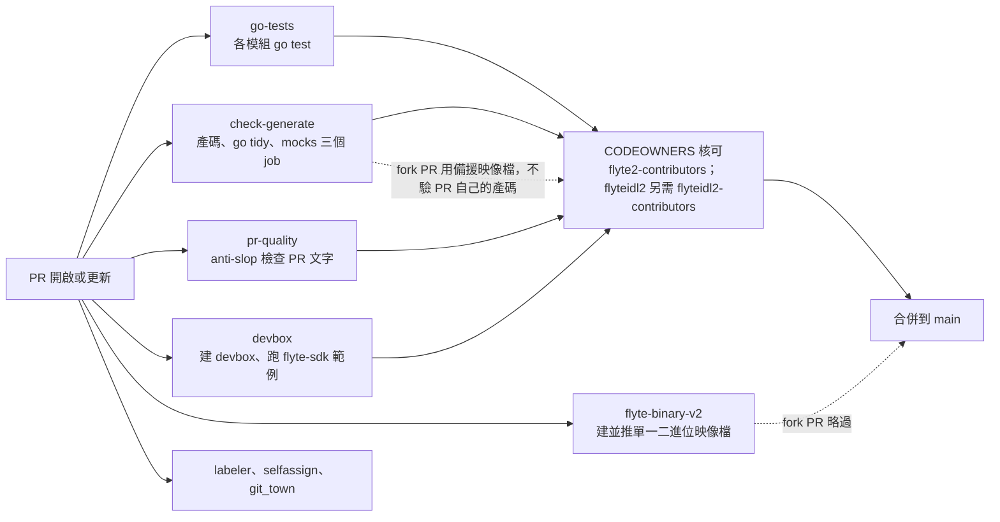

# CI 檢查什麼、誰來核

> 這一頁回答：一個 PR 開出來會被哪些檢查跑過、fork PR 少了什麼、最後誰有權核可。

## 一個 PR 的旅程

## workflow 清單

| workflow | 觸發 | 檢查什麼 | fork PR |
|---|---|---|---|
| `go-tests.yml` | push main、PR | 依矩陣跑各模組的 `go test` | 會跑 |
| `check-generate.yml` | PR | `check-generate` 重產碼比對、`check-go-tidy`、`check-mocks` | 跑，但用備援映像檔，不驗 PR 自己的產碼 |
| `pr-quality.yml` | `pull_request_target` | `peakoss/anti-slop` 檢查 PR 文字品質 | 會跑 |
| `devbox.yml` | push main、PR、手動 | 建 devbox、啟動、用 `flyte-sdk` 範例做功能測試 | 未確認 |
| `flyte-binary-v2.yml` | push、PR、手動 | lint bootstrap、建並推單一二進位與 devbox 映像檔 | 略過建置與推送 |
| `build-ci-image.yml` | 見檔案 | 建 CI 用映像檔 | 略過，且不留言 |
| `check-helm-docs.yml` | 見檔案 | chart README 與 values 一致 | 未確認 |
| `labeler.yml`、`selfassign.yml`、`git_town.yml` | 見檔案 | 自動標 label、自我指派、PR stack 顯示 | 未確認 |
| `regenerate-on-comment.yml` | PR 留言 | 依留言重跑產碼 | 未確認 |
| `publish-helm`、`publish-npm`、`publish-python`、`publish-rust`、`update_site` | release 或 push | 發布四種產物與網站 | 不適用 |
| `v1-*.yml` | 見檔案 | Flyte 1 的 release 流程 | 不適用 |

「見檔案」與「未確認」代表本地圖只讀了名稱或前幾行，觸發條件請直接開檔確認。

## fork PR 的特殊規則

`CONTRIBUTING.md` 明寫：fork PR 在隔離環境跑，拿不到 repo secrets，所以會建或推映像檔、會留言的 job 都略過。對貢獻者：略過不算失敗，本機先跑 `make gen` 與測試。對維護者：fork PR 上綠的產碼檢查要當「沒跑」，合併前要本機 checkout 驗證，或在貢獻者同意下把分支推到 `flyteorg/flyte` 跑完整 CI。

## 誰來核

| 路徑 | 團隊 |
|---|---|
| 全部 | `@flyteorg/flyte2-contributors` |
| `/flyteidl2/` | `@flyteorg/flyteidl2-contributors`，後面的規則覆蓋前面 |

## PR 品質的兩道門

- **DCO**：每個 commit 要 `git commit -s`，`.github/dco.yml` 啟用檢查。
- **anti-slop**：`pr-quality.yml` 會檢查 PR 文字。issue label 裡有一個 `Code agent slop`，代表維護者會標記低品質的 AI 產出 PR。用 AI 輔助沒問題，但 PR 描述要能說清楚為什麼與怎麼測。

## 讀到這裡你應該能

開 PR 前預測哪些檢查會跑、哪些會略過、誰會被 request review；看到紅燈時知道先開哪個 workflow 檔。

## 證據

`.github/workflows/` 清單、`go-tests.yml`、`check-generate.yml`、`pr-quality.yml`、`devbox.yml`、`flyte-binary-v2.yml`、`CODEOWNERS`、`.github/dco.yml`、`CONTRIBUTING.md`、快照當日的 issue label 清單。

<!-- nav -->
---

上一頁 [04 · 程式碼地形](./directory-map.md) ｜ [總覽](../README.md) ｜ 下一頁 [05 · 旅程 1：跑起 devbox](../05-contribution-paths/run-devbox-and-watch-a-run.md)
