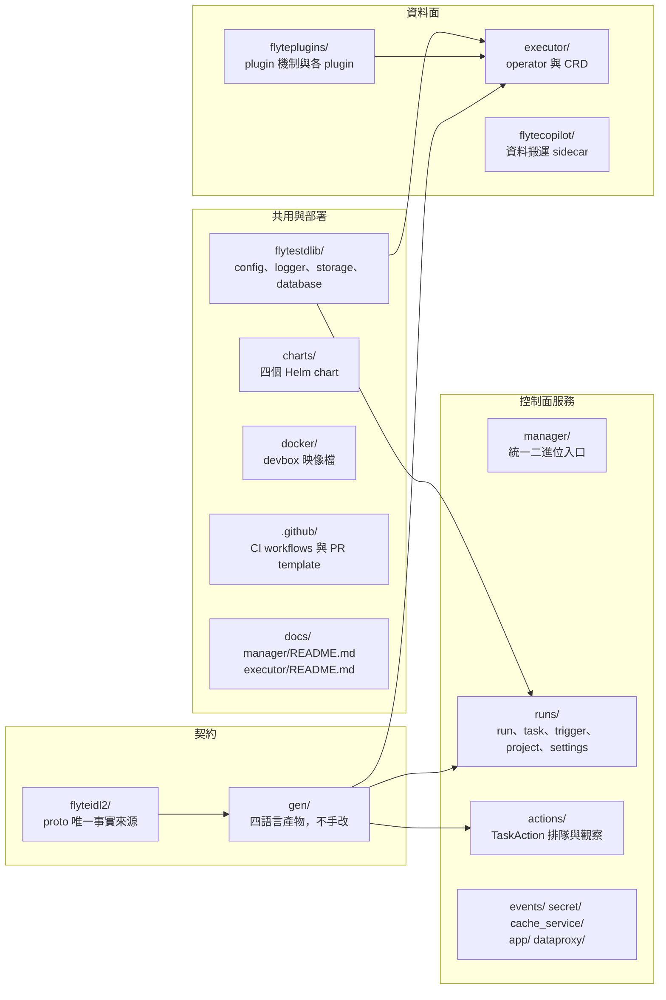

# 程式碼地形：哪個資料夾對應哪個概念

> 這一頁回答：打開 repo 看到三十幾個頂層目錄時，哪個對應哪個概念、該先開哪個檔。

## 四塊地形

## 目錄清單

檔案數為快照當日 `git ls-tree` 的結果，只是給你規模感。

| 目錄 | 檔案數 | 裡面是什麼 | 先開哪個檔 |
|---|---|---|---|
| `gen/` | 784 | 四種語言的產碼 | 不用開，改 proto 後由 `make gen` 更新 |
| `flyteplugins/` | 282 | `go/tasks/pluginmachinery/` 是 plugin 機制，`go/tasks/plugins/` 是各 plugin | `go/tasks/pluginmachinery/core/plugin.go` |
| `flytestdlib/` | 265 | 共用套件，Flyte 1 傳承 | `app/`（統一啟動框架）、`storage/`、`database/` |
| `runs/` | 128 | RunService 等記帳服務、repository、migration、cron 排程 | `service/run_service.go`、`migrations/sql/` |
| `flyteidl2/` | 105 | proto | `workflow/run_definition.proto`、`actions/actions_service.proto` |
| `executor/` | 103 | operator、CRD 型別、plugin 接線、webhook | `api/v1/taskaction_types.go`、`pkg/controller/taskaction_controller.go` |
| `charts/` | 100 | flyte-binary、flyte-core、flyte-devbox、flyteconnector | 各 chart 的 `README.md` |
| `docker/` | 47 | devbox 映像檔與 bootstrap 程式 | `devbox-bundled/Dockerfile` |
| `boilerplate/` | 37 | 共用的 Makefile 與 lint 設定 | 通常不用碰 |
| `.github/` | 25 | workflows、PR template、dependabot、labeler | `workflows/`，見 [ci-and-owners.md](./ci-and-owners.md) |
| `flytecopilot/` | 22 | downloader 與 sidecar 二進位 | `README.md` |
| `dataproxy/` | 22 | 簽名 URL、上傳、叢集選擇 | `README.md`、`service/dataproxy_service.go` |
| `cache_service/` | 20 | 快取服務與兩張表 | `service/`、`migrations/sql/` |
| `actions/` | 14 | ActionsService 與 Kubernetes client | `service/actions_service.go`、`k8s/client.go` |
| `app/` | 13 | App 服務與內部代理 | `setup.go` |
| `manager/` | 7 | 統一二進位、config 範例、開發說明 | `README.md`、`cmd/components.go` |
| `secret/`、`events/` | 7、6 | SecretService、EventsProxyService | 各自的 `service/` |
| `docs/` | 5 | 後端說明、實作規格、Docker 說明、一份 RFC | `BACKEND_README.md` |
| `scripts/`、`monitoring/` | 3、2 | 開發腳本、Grafana dashboard | 需要時再看 |

頂層另有 `buf.yaml`、四個 `buf.gen.*.yaml`、`go.mod`、`Makefile`、`go.Makefile`、`Dockerfile`、`gen.Dockerfile`、`.mockery.yaml`、`CODEOWNERS`、`CONTRIBUTING.md`。

## 兩個容易誤會的地方

- `docs/IMPLEMENTATION_SPEC.md` 描述的目錄結構（`queue/`、`state/`、`cmd/flyte-services/`）與現況不同，那是早期設計稿；現況以 `manager/` 與 `actions/` 為準。
- `executor/` 底下有自己的 `.github/`、`.devcontainer/`、`PROJECT`，那是 kubebuilder 腳手架留下的，CI 以頂層 `.github/` 為準。

## 讀到這裡你應該能

看到一個 issue 描述，先說出它落在四塊地形的哪一塊，再說出該開的目錄。

## 證據

快照 `f7628a55` 的 `git ls-tree -r`；各目錄的 `README.md`；`docs/IMPLEMENTATION_SPEC.md` 與 `manager/README.md` 的對照。
