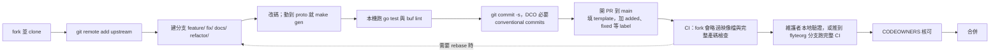

# 旅程 4：第一個 PR，從 fork 到合併

> 這一頁回答：第一個 PR 從 fork 到合併要過哪幾關，每一關要準備什麼。

## 關卡

## PR template 要填什麼

`.github/PULL_REQUEST_TEMPLATE.md` 的段落：

| 段落 | 寫什麼 |
|---|---|
| Tracking issue | `Closes #999` 或 `Related to #999` |
| Why are the changes needed? | 新 API 寫使用情境，修 bug 寫為什麼是 bug |
| What changes were proposed? | 改了什麼；有類別關係就畫出來，有設計文件就貼連結 |
| How was this patch tested? | 加了哪些測試；沒加要說明為什麼 |
| Labels | `added`、`changed`、`deprecated`、`removed`、`fixed`、`security` 至少一個，release notes 靠這個分類 |
| Check boxes | 文件已更新、測試通過、commit 已 sign-off |
| Stack、Docs link | 用 git town 管 PR stack 才需要；文件連結由 CI 產生 |

## 三個會被退回的原因

1. **沒有 `-s`**：DCO 檢查不過。補救是 `git commit --amend -s` 再 force push。
2. **`gen/` 沒跟著改**：`check-generate` 失敗。補救是 `make gen` 後 commit。
3. **PR 文字空洞**：`pr-quality.yml` 的 anti-slop 會檢查，維護者也有 `Code agent slop` 這個 label。寫清楚為什麼與怎麼測。

## 審查中的互動

`CONTRIBUTING.md` 的建議：盡快回覆、推新 commit 到同一分支、小修正可以 amend 後 force push、審查可能需要時間。fork PR 的 CI 綁手綁腳，主動在 PR 裡貼本機測試的輸出會讓維護者好做事。

## 做完這條旅程你應該能

開出一個第一次就通過 DCO、產碼檢查與 template 要求的 PR，並預期哪些檢查會被略過。

## 證據

`CONTRIBUTING.md`（Development Workflow、Submitting Changes、CI Checks on Pull Requests from Forks）、`.github/PULL_REQUEST_TEMPLATE.md`、`.github/dco.yml`、`.github/workflows/pr-quality.yml`、`CODEOWNERS`。

<!-- nav -->
---

上一頁 [05 · 旅程 3：改一個 proto 欄位](./change-a-proto-field.md) ｜ [總覽](../README.md) ｜ 下一頁 [06 · 哪個分支或 repo](../06-decision-trees/which-branch-or-repo.md)
