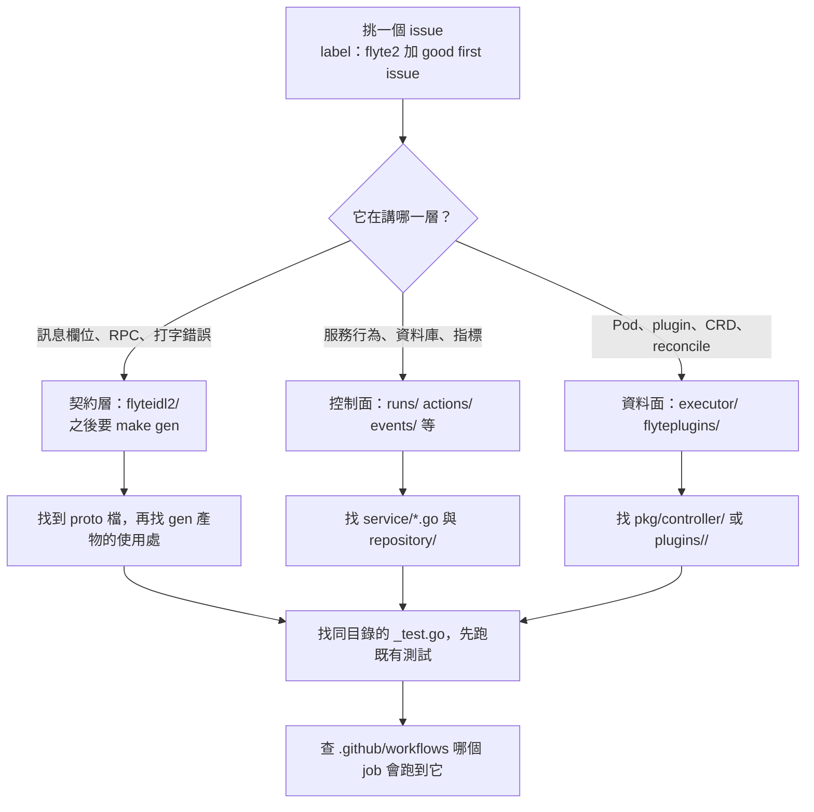

# 旅程 2：從一個 issue 走到該改的檔案

> 這一頁回答：拿到一個 good first issue 之後，怎麼在五分鐘內定位到目錄、檔案與測試。

## 定位流程

## 兩個實例

快照當日開放的 good first issue，用上面的流程走一次：

| issue | 一句描述 | 層 | 定位 |
|---|---|---|---|
| #7558 | proto 欄位 `funtion_name` 打錯字，應為 `function_name` | 契約 | `flyteidl2/workflow/run_definition.proto` 的 `ActionMetadata`。改名會影響 JSON 名稱與四種產物，要看 `CONTRIBUTING.md` 的相容性規則，並注意 SDK stubs 在別的 repo |
| #7205 | Executor 加 `MaxConcurrentReconciles` 設定 | 資料面 | `executor/pkg/config/config.go` 加欄位，`executor/setup.go` 建 controller 時帶入；位置為推測，以 issue 討論為準 |

其餘多數 good first issue 是 Prometheus 與 OTEL 指標：executor 的 reconcile、GC、cache、plugin 指標，actions 的 watcher 指標，runs 的 repository 與 abort reconciler 指標。它們的共同入口是 `flytestdlib/promutils/`、`flytestdlib/otelutils/` 與各服務的 `metrics.go`。

## 找測試的慣例

- Go 測試與被測檔同目錄同名加 `_test.go`。
- `runs/test/`、`executor/test/`、`dataproxy/test/` 是整合測試。
- `flyteplugins/tests/end_to_end.go` 是 plugin 的端到端測試工具。
- 改了 Go 介面要 `make mocks`，CI 的 `check-mocks` 會比對。

## 開始改之前

1. 在 issue 留言認領，避免撞工。
2. 讀 `CODEOWNERS` 知道誰會來核；契約層的改動多一個團隊。
3. 先跑一次既有測試，確認環境沒問題再動手。

## 做完這條旅程你應該能

拿到任何一個 `flyte2` issue，在不問人的情況下說出它的層、目錄、要跑的測試與會跑到的 CI。

## 證據

快照當日 `gh issue list --label "good first issue"` 的結果、`flyteidl2/workflow/run_definition.proto`、`executor/pkg/config/`、`executor/setup.go`、`flytestdlib/promutils/`、各目錄的 `test/`。
