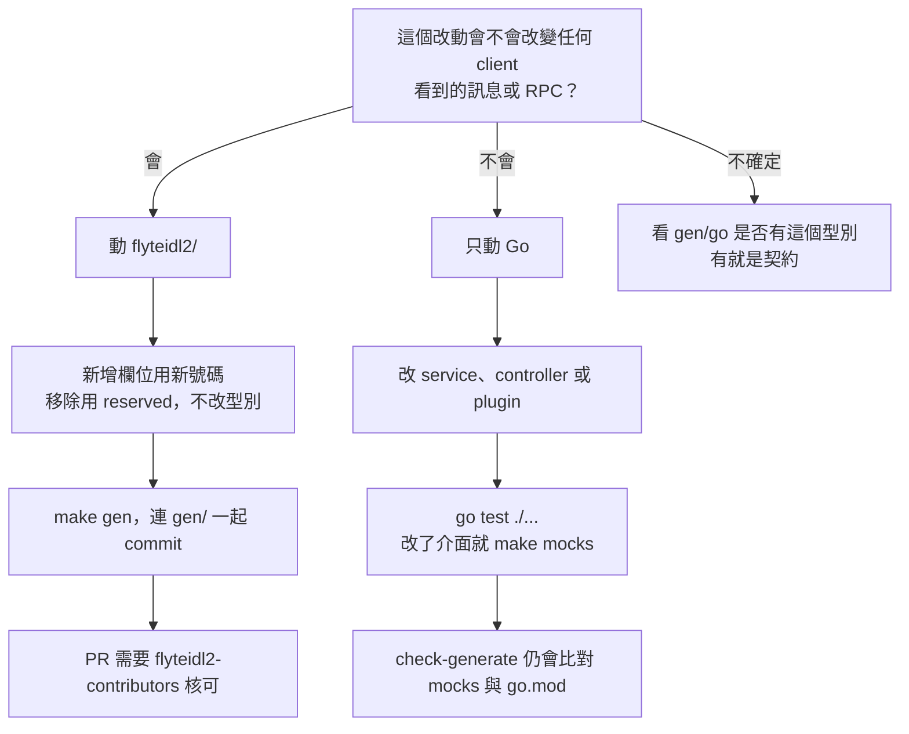

# 決策樹：要動 proto 還是只動 Go

> 這一頁回答：一個改動該不該碰 `flyteidl2/`，以及兩條路各自要多做什麼。

## 判斷的三個問題

1. **會不會出現在 API 上**：新增一個對外欄位、改回應內容、加一個 RPC，都是契約。
2. **會不會改變序列化結果**：改 JSON 名稱、改 enum 值，即使 wire 相容也算契約。
3. **只是實作細節**：改 reconcile 邏輯、加指標、改 SQL 查詢、改 chart，都不是契約。

## 兩條路的成本

| | 動 proto | 只動 Go |
|---|---|---|
| 要跑的指令 | `make buf-lint`、`make gen`、四種產物驗證 | `go test ./...`，介面變了加 `make mocks` |
| CI 會多檢查 | `check-generate` 對 `gen/` 全部 | `check-mocks`、`check-go-tidy` |
| 核可 | 兩個團隊 | 一個團隊 |
| 下游影響 | `flyte-sdk`、`flyteconsole`、`flyte-sdk-rs` 都可能要跟 | 通常只在本 repo |

## 一個常見的中間情況

只在 Go 裡新增一個內部 config 欄位（例如 Executor 的 reconcile 並行數），不是契約；但如果這個設定要讓使用者從 `SettingsService` 設定，就要先在 `flyteidl2/settings/` 加欄位，變成契約改動。先想清楚「誰會設定它」再決定走哪條路。

## 證據

`CONTRIBUTING.md`、`CODEOWNERS`、`.github/workflows/check-generate.yml`、`Makefile`、`docs/rfcs/20260804_settings_service.md`。
