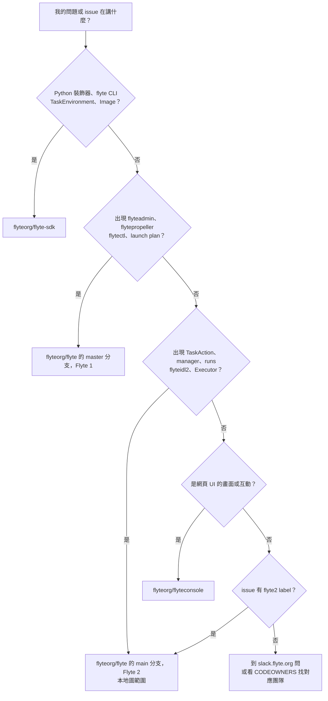

# 決策樹：這個問題屬於哪個分支或 repo

> 這一頁回答：看到一個 issue、一段錯誤訊息或一個功能想法時，怎麼判斷它該去 `flyte` 的 `main`、`master`，還是 `flyte-sdk`、`flyteconsole`。

## 為什麼會混

`flyteorg/flyte` 一個 repo 兩條分支、兩代產品。`main` 是 Flyte 2，`master` 是仍在維護的 Flyte 1，兩邊的目錄結構、名詞、CI 都不同。issue tracker 是共用的，所以 `flyte2` label 是最可靠的分辨訊號。GitHub 搜尋結果、Slack 舊訊息、部落格文章大多在講 Flyte 1，讀到 `flyteadmin`、`propeller`、`launch plan` 就要警覺。

## 名詞對照速查

| 看到 | 屬於 |
|---|---|
| `@env.task`、`flyte.run`、`flyte.serve`、`TaskEnvironment`、`Image.from_debian_base` | `flyte-sdk` |
| `TaskAction`、`ActionsService`、`RunService`、`flyte-manager`、`flyteidl2` | `flyte` 的 `main` |
| `flyteadmin`、`flytepropeller`、`datacatalog`、`flytectl`、`launch plan`、`node` | `flyte` 的 `master` |
| `flyteidl` 沒有 2 | Flyte 1 |
| 畫面、表格、圖表 | `flyteconsole` |

## 相關 repo

| repo | 語言 | 用途 |
|---|---|---|
| `flyteorg/flyte-sdk` | Python、Rust | Flyte 2 的使用者 SDK 與 CLI |
| `flyteorg/flyte-sdk-rs` | Rust | Rust SDK |
| `flyteorg/flyteconsole` | TypeScript | UI |
| `flyteorg/flytekit` | Python | Flyte 1 的 SDK |
| `flyteorg/flytesnacks` | Python | Flyte 1 範例 |

## 證據

`README.md` 的 Flyte 1 與 2 說明、`master` 分支的頂層目錄、快照當日的 issue label 清單、`CODEOWNERS`、`flyteorg` 組織的 repo 清單。
