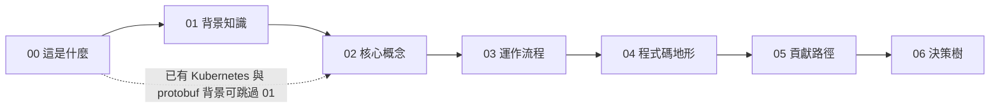

# Flyte 2 Mental Map

> 給想成為 [flyteorg/flyte](https://github.com/flyteorg/flyte) contributor、但沒有 Go、Kubernetes、工作流排程背景的人。讀完不保證能立刻送出 PR，但會對這個專案有一個扎實、可驗證的整體理解，知道從哪裡下手。

| 快照 | 值 |
|---|---|
| 對象 repo | `flyteorg/flyte` |
| 分支 | `main`（Flyte 2） |
| commit | `f7628a55fd913ff0f126259802379d79ff4f0908` |
| 最近 release | `v2.0.48`（2026-09-03） |
| 地圖完成日 | 2026-09-17 |

這張地圖是一次性快照，不自動同步。每頁末尾的「證據」列出對應的目錄或檔案，只引用目錄名、服務名與文件，不引行號。若與上游現況不符，以上游為準。

## 閱讀路線

建議一次讀一層。02 是最厚的一層，八個概念各一頁；03 之後每頁都回頭引用 02 的概念名。

## 讀完你應該能做到

1. 用自己的話說出 Run、Action、TaskAction 三者的關係，以及為什麼 Flyte 2 沒有 DAG。
2. 看到一個標 `flyte2` 的 issue，能指出它屬於契約、控制面還是資料面，以及該開哪個資料夾。
3. 在本機跑起 devbox，建立一個 run，並在 `kubectl` 與資料庫裡看到它的痕跡。
4. 知道第一個 PR 會被哪些 CI 檢查、fork PR 少了什麼、誰會來核。
5. 判斷一個問題該去 `flyte`、`flyte-sdk` 還是 Flyte 1 的 `master` 分支。

## 地圖層次

| 層 | 回答什麼 | 頁面 |
|---|---|---|
| 00 這是什麼 | 一段話定義、它不是什麼、五問速答、全景圖 | [00-what-is-flyte2.md](./00-what-is-flyte2.md) |
| 01 背景知識 | 讀 02 之前要先認識的六個外部概念 | [01-background](./01-background/README.md) |
| 02 核心概念 | 術語表與八個必懂概念，每個一頁一圖 | [02-core-concepts](./02-core-concepts/README.md) |
| 03 運作流程 | 從 `flyte.run()` 到 Pod 結束、父子 action、失敗處理、本機拓樸 | [03-how-it-runs](./03-how-it-runs/create-run-to-pod.md) |
| 04 程式碼地形 | 哪個資料夾對應哪個概念、CI 檢查什麼、誰核 | [04-code-terrain](./04-code-terrain/directory-map.md) |
| 05 貢獻路徑 | 四條從理解走到第一個 PR 的旅程 | [05-contribution-paths](./05-contribution-paths/run-devbox-and-watch-a-run.md) |
| 06 決策樹 | 這個問題屬於哪個分支或 repo、要動 proto 還是只動 Go、哪些 label 適合新手 | [06-decision-trees](./06-decision-trees/which-branch-or-repo.md) |

## 完整閱讀順序

每頁尾都有「上一頁 ｜ 總覽 ｜ 下一頁」，可從第一頁一路讀到底。

1. [00 · Flyte 2 是什麼](./00-what-is-flyte2.md)
2. [01 · 背景知識](./01-background/README.md)
3. [02 · 核心概念總表](./02-core-concepts/README.md)
4. [02 · Run 與 Action 樹](./02-core-concepts/run-and-action-tree.md)
5. [02 · ActionPhase 狀態機](./02-core-concepts/action-phase.md)
6. [02 · 沒有 DAG](./02-core-concepts/no-dag-dynamic-enqueue.md)
7. [02 · TaskAction CRD 與 Executor](./02-core-concepts/taskaction-crd-and-executor.md)
8. [02 · Plugin 體系](./02-core-concepts/plugins.md)
9. [02 · 契約優先與多語言產碼](./02-core-concepts/contract-and-codegen.md)
10. [02 · 統一 manager 與八個服務](./02-core-concepts/manager-and-services.md)
11. [02 · 控制面與資料面](./02-core-concepts/control-plane-vs-data-plane.md)
12. [03 · 從 flyte.run() 到 Pod 結束](./03-how-it-runs/create-run-to-pod.md)
13. [03 · 父子 action 的 Watch 與 Enqueue](./03-how-it-runs/parent-child-watch.md)
14. [03 · 失敗、重試、超時、中止](./03-how-it-runs/failure-retry-abort.md)
15. [03 · devbox 拓樸](./03-how-it-runs/devbox-topology.md)
16. [04 · 程式碼地形](./04-code-terrain/directory-map.md)
17. [04 · CI 檢查什麼、誰來核](./04-code-terrain/ci-and-owners.md)
18. [05 · 旅程 1：跑起 devbox](./05-contribution-paths/run-devbox-and-watch-a-run.md)
19. [05 · 旅程 2：從 issue 到檔案](./05-contribution-paths/from-issue-to-code.md)
20. [05 · 旅程 3：改一個 proto 欄位](./05-contribution-paths/change-a-proto-field.md)
21. [05 · 旅程 4：第一個 PR](./05-contribution-paths/first-pr.md)
22. [06 · 哪個分支或 repo](./06-decision-trees/which-branch-or-repo.md)
23. [06 · proto 還是 Go](./06-decision-trees/proto-or-go.md)
24. [06 · 哪些 label 適合新手](./06-decision-trees/labels-for-newcomers.md)

## 這張地圖不涵蓋什麼

1. 不涵蓋 Flyte 1（`master` 分支）以及 flyteadmin、flytepropeller 的內部。
2. 不涵蓋 `flyte-sdk` 的內部，包含 SDK 端 controller 的實作與它用到的 RPC 細節。
3. 不涵蓋 union.ai 的商業功能與託管服務。
4. 不是 Kubernetes、Go、protobuf 的教學；01 只給一段話與外部連結。
5. 不是營運手冊：不談生產環境的規模調校、多叢集的 queue 對應、EventsProxy 的 Redis 路徑、App Service 的 Knative 細節、run 級並行上限由哪個排程器執行。
6. 與 Airflow、Argo、Prefect、Temporal 的定位比較未經核對，只在 00 以一句話帶過並標明為假設。

## 這張地圖怎麼做出來的

依 [mental-map-map](https://github.com/shaun-agent/mental-map-map) 的五步驟：意圖卡、只讀不畫的探索報告、五問、圖表規劃、寫文件。Step 1 到 3 的過程檔保留在 [drafts/](./drafts/)，方便對照每一句話的來源。換一個開源專案時，複製這個資料夾骨架、換掉內容即可。
